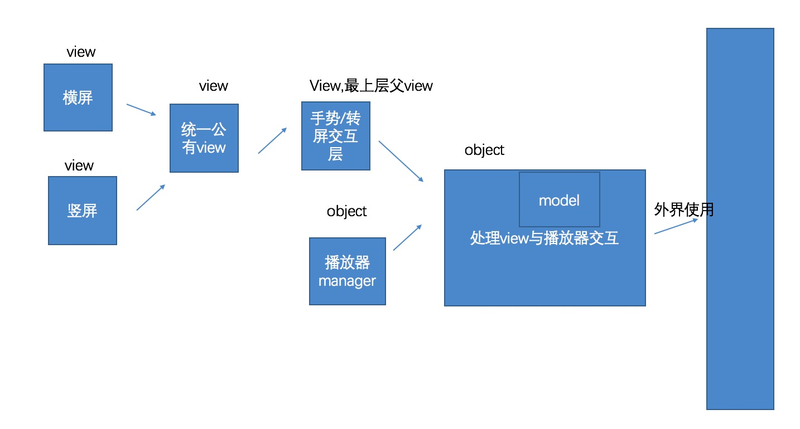

# LMIJKPlayer
基于IJKPlayer，支持横屏、竖屏，上下滑动调节音量、屏幕亮度，左右滑动调节播放进度, 支持横竖屏UI不同的完整播放器Demo

由于IJKPlayer包过大, 没有放在项目里, 需要的童鞋请自行打包, 拖到项目中

##特性
* 支持横、竖屏切换和展示不同UI
* 左侧1/2位置上下滑动调节屏幕亮度（模拟器调不了亮度，请在真机调试）
* 右侧1/2位置上下滑动调节音量（模拟器调不了音量，请在真机调试）
* 支持滑动屏幕快进快推
* 支持在当前页面播放新的视频
* 支持显示上次播放记录
* 支持从某个位置开始播放
* 支持播放页横竖屏, 其他页面仅支持竖屏

##要求
* iOS8+
* Xcode8+

##播放器设计模块划分
播放器组成部分的大概划分如下图:

* 本Demo中为了使用方便, 将播放器的一些状态记录在`LMPlayerStatusModel`中, 优点是方便View层获取, 但缺点显而易见, 容易被篡改, 有待以后优化
* `LMPlayerModel`中是存放的是播放器所需的数据, 可详见属性解释

##效果演示

##参考链接
[https://github.com/renzifeng/ZFPlayer](https://github.com/renzifeng/ZFPlayer)

##联系我
* 邮箱:[liyikun2333@gmail.com](liyikun2333@gmail.com)

